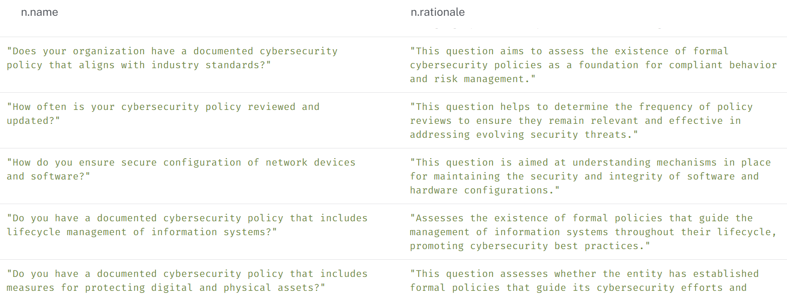

# CSF Knowledge Graph (KG)

Organizations transitioning from NIST CSF version 1.1 to version 2.0 must address new and expanded requirements. With this prototype, we are attempting to explore and address the complexities and challenges of such transitioning efforts through use cases, leveraging LLM, Knowledge Graphs (KG) and RAG approaches. 

Some of the high-level use-cases considered in the process include:

- Graph based inference to effectively identify/discover derived relationships, cross-standard and cross-control implementation dependencies extending beyond NIST/Other Authority and SME provided explicit mappings. 
- Capability to perform compliance and risk assessments, across versions of CSF frameworks, potentially expanding to other mapped standards including:
  - CIS Critical Security Controls (CSC)
  - Control Objectives for Information and Related Technologies (COBIT) 5
  - ISA 62443-2-1:2009 & ISA 62443-3-3:2013 - Security Requirements (SR)
  - ISO/IEC 27001:2013
  - NIST SP 800-53 Rev. 4 & Rev. 5.1.1
  - CIS Controls v8.0
  - Cyber Resilience Index (CRI) Profile v2.0 
  - NIST SP 800-221A
  - Secure Software Development Framework SSDF v1.1
- Support for RAG (Retrieval-augmented-generation) in the provision of high-quality features, and embeddings for Generative AI, potentially addressing shortcomings and hallucinations in large language models (LLMs).

**Description**:  

Python and AuraDB [Neo4J] KG prototype, along with the basic command-line utilities for building and deploying the CSF v2.0 and v1.1 network of nodes and relationships. Resulting KG provides:
 - *Standards & Controls Subgraph* with explicit mappings captured from NIST CSF v2.0 documentation and toolkits
 - *Key Concept Subgraph* capturing the semantics of CSF controls. The processing pipeline for this subgraph leverages intermediary Open AI-generated core concept segments as a corpus,  along with PatternRank + KeyBERT.
 - *Assessment Questionnaire Subgraph* scoped by CSF controls, capturing corpus segments generated by Open AI and indexed via LangChain + Open AI embeddings for RAG scenarios.

**Status**:  Baseline version 1.0

---
### KG Model


---

### Model Build, Processing and RAG Pipelines


## Runtime Env and Dependencies
*Tested on*: Ubuntu 22.04 - *Python Version*: 3.10.12 

*Requires:* Pyhton version 3.10 or greater

Active [OpenAI API](https://platform.openai.com/) subscription allowing access to GPT 3.5+ (More on creating API keys at: [Go-OpenAI](https://github.com/sashabaranov/go-openai?tab=readme-ov-file#getting-an-openai-api-key) https://github.com/sashabaranov/go-openai?tab=readme-ov-file#getting-an-openai-api-key

Active [Neo4J - Aura](https://neo4j.com/cloud/platform/aura-graph-database/) free-tier subscription for protototype graph database access and deployment 

Optional for Inference [Langsmith](https://smith.langchain.com/) free-tier developer subscription for langchain LLM applications development platform.

## Configuration

#### ChatGPT API Connectivity

The utility expects the following environment variables to be set:

```bash
export NEO4J_URI=<YOUR_AURADB_URI>
export NEO4J_USER='neo4j'
export NEO4J_PASSWORD=<YOUR_AURADB_PWD>
export OPEN_API_SECRET=<YOUR_OPEN_API_SECRET>
```

###### Graph Build Settings

Sample keyBERT configuration is available at: `./config/keybert.json`
For graph model and CSV/JSON extraction paths, constants and enumerations, refer to `./config/includes.py`


## KG Exploration and Usage

Following AuraDB [Neo4J] Cypher and command line utilities are built to demonstrate  a small subset of CSF KG use-cases:

#### Knowledge Graph Inferences / Queries

###### Exploring CSF 2.0 Key Concepts

- AuraDB [Neo4J] (Cypher) graph query illustrating PatternRank + KeyBert, [KeyBert + LLM] extracted *Key Concept Nodes*

  - ```cypher
    MATCH (ctrl:CONTROL {name:"GV.OC-01"})-[rels:CAPTURES]->(keyc:KEYCONCEPT) 
    RETURN keyc.name;
    ```
  
  |                                                         |                                                         |
  | ------------------------------------------------------- | ------------------------------------------------------- |
  |  |  |
  
  * Comparing the *Key Concept* relevance and quality for the CSF vs 2.0 control **GV.OC-01** resulting from the processing pipeline with an intermediary Open AI extraction layer -> PatternRank (w KeyBERT)
    to the following sampling of key-terms extracted with KeyBERT alone, directly working with the Open-AI generated corpus:
  
    > `python main.py extract --keyphrase --file corpus/csf-core/GV.OC-01.txt`
    > 
    > Extract Key Phrase - File: corpus/csf-core/GV.OC-01.txt , config:  {}
    >
    > Key phrase:  ('**nist cybersecurity framework**', 0.6294)
    >
    > Key phrase:  (**'impacted cybersecurity risks**', 0.5425)
    >
    > Key phrase:  ('**csf version released**', 0.4583)
    >
    > Key phrase:  ('**controls risk assessments**', 0.3998)
    >
    > Key phrase:  ('**continuous improvement ensure**', 0.3597)
    >
    > Key phrase:  ('**trends implementation policy**', 0.3334)
    >
    > Key phrase:  ('**organizational mission broader**', 0.3212)
    >
    > Key phrase:  ('**revisions new control**', 0.3164)
    >
    > Key phrase:  ('**gv oc hypothetical**', 0.1893)
  

###### Exploring *Key Concept Subgraph* with Cross-control/Standard Mappings 

Sample AuraDB [Neo4J] (Cypher) query exploring CSF v 2.0  and the (explicitly and by association) mapped v 1.1 controls clustered around the *Key Concept*: `incident response`

  ```cypher
  MATCH (keyc:KEYCONCEPT {name: "incident response"})<-[rels:CAPTURES]-(ctrl2:CONTROL)-[map:MAPS_TO]-(ctrl1:CONTROL)<-[stdc:HAS_CONTROL]-(std1:STANDARD)
  RETURN keyc, ctrl2,ctrl1, std1, rels, map, stdc
  ```

  |  |
  | ------------------------------------------------------------ |
  |  |

#### CSF Compliance Assistant - LLM + RAG 

Two additional inference options have been implemented (`./infer/raggraph.py`) to demonstrate direct and augmented approaches to query LLM (Open AI/ChatGPT) for a default question around the *Assessment Questionnaire Subgraph*:  

<u>What are some example questions for me to assess my organization for NIST CSF version 2.0 controls in GOVERN functional category?</u> 

[Please note that custom questions within the context of CSF Controls and compliance assessment can be tested using the option `--question` e.g., `python main.py infer --[plain|rag] --question <MY-CUSTOM-QUESTION>`].

- Plain Mode: No KG augmentation, the question is directed to LLM (Open AI/ChatGPT) as is 	

  - > `python main.py infer --plain`
    >
    > ChatGPT inference result: 
    > To assess your organization for NIST CSF version 2.0 controls in the GOVERN functional category, you can ask the following example questions:
    >
    > 1. Has the organization established foundational guidelines for managing cybersecurity risks?
    > 2. Is there formalized cybersecurity governance documentation in place?
    > 3. To what extent have cybersecurity best practices and standards been incorporated into operational policies and procedures?
    > 4. Is there formal documentation guiding cybersecurity practices in alignment with broader organizational goals?
    > 5. Are there foundational governance guidelines for the detection of cybersecurity events?
    > 6. How does the organization assess the effectiveness of its resource allocation for continual improvement in cybersecurity governance?
    > 7. Is there a process in place to turn past experiences into actionable improvements for future cybersecurity events?
    > 8. Are there guidelines and a formal structure for monitoring activities to effectively identify cybersecurity events?
    > 9. Has the organization established a formal cybersecurity governance framework?

- RAG mode: The question is augmented by referencing custom Assessment Questions corpus segments in KG

  - > `python main.py infer --rag`
    >
    > Infer with question KG augmentation for LLM - Question: What are some example questions for me to assess my organization for NIST CSF version 2.0 controls in GOVERN functional category?
    > ChatGPT rag-inference result: 
    > Some example questions to assess your organization for NIST CSF version 2.0 controls in the GOVERN functional category are:
    >
    > 1. Do you have documented policies and procedures for managing cybersecurity risks?
    > 2. Does your organization have documented policies and procedures that support cybersecurity governance?
    > 3. What processes are in place for *evaluating the effectiveness of allocated resources* for governance of cybersecurity?
    > 4. How does your organization align its cybersecurity policies and processes with established frameworks?
    > 5. Do you have documented cybersecurity policies and procedures aligned with organizational objectives?
    > 6. How do you integrate *lessons learned from past incidents into your current incident response* strategies?
    > 7. Do you have formal policies and *procedures for monitoring network traffic and data flows*?
    > 8. Has your organization defined and documented policies and procedures for managing cyber risk?


For the most part, the resulting questions are fairly similar. And yet, despite the identical LLM (Open AI/ChatGPT) prompt & retrieval chain settings, the plain mode results in more generic content/terminology, where its generated question set appears less concise & less diversified. 

On the other hand, as we look at a sampling of Assessment Questions categorized under the GOVERN function [referring to a sampling of the KG Cypher query results below], we can recognize the impact of the augmentation in RAG mode's relatively more relevant and concise result set.

```cypher
MATCH (n:QUESTION)-[:ASSESSES]->(c:CONTROL) 
WHERE c.functional_category STARTS WITH "GOVERN" 
RETURN  distinct n.name, n.rationale;
```




#### Other Utilities

Additional command-line options/settings are available for testing various KG model build/maintenance utilities

> usage: main.py [-h] {extract,csfmod,tester,infer} ...
> 
>CSF knowledge graph KG build utilities and query demos
> 
>positional arguments:
> {extract,csfmod,tester,infer}
>    extract             KeyPhrase(from text) extraction testing: KeyBERT vs KeyBERT+PatternRank
>     csfmod              CSF KG build utilities for Assessment Questionnaire, Key Concept and Control/Standard Subgraphs
>     tester              KG tester utilities for Neo4j and other LLM connectivity testing
>     infer               Graph + RAG inference demonstrations
>    
>options:
> -h, --help            show this help message and exit

+ KeyPhrase extraction

  > usage: main.py extract [-h] (--patternrank [PATTERNRANK] | --keyphrase [KEYPHRASE]) --file FILE
  >
  > options:
  >   -h, --help            show this help message and exit
  >   --patternrank [PATTERNRANK]
  >                         Extract keyphrases from corpus document with optional parameters using patternrank vectorizer
  >   --keyphrase [KEYPHRASE]
  >                         Extract Keyphrases corpus document with optional parameters
  >   --file FILE           Filepath

+ Neo4J Access

  > usage: main.py tester [-h] (--neo4j [NEO4J] | --openai [OPENAI])
  >
  > options:
  >   -h, --help         show this help message and exit
  >   --neo4j [NEO4J]    Test Neo4j connectivity
  >   --openai [OPENAI]  Test OpenAI connectivity

+ AuraDB upload for subgraphs capturing: 
  + Standard, Control cross-maps 
  + Key concept network
  + Assessment Questionnaires
  
  >   -h, --help            show this help message and exit
  >   --keyconcept [KEYCONCEPT]
  >                         Generate CSF key concept nodes and edges in JSON with optional parameters
  >   --assess [ASSESS]     Generate assessment questionnaire with question nodes and econtrol dges in JSON with optional parameters
  >   --tocsv [TOCSV]       Dump JSON CSF nodes and edges to CSV with optional parameters
  >   --outdir OUTDIR       File written to directory
  
  


## Testing

[TODO] Rudimentary testing to be provided via `PyTest`

## Features to Implement & Known issues

- Baseline testing for `NEO4JConnector`, `GraphProcessor`, and `KeyTermExtractor` classes
- Inference Module to be added demonstrating RAG via LangChain+OpenAI Embeddings
- Dockerized version for the CLI
- Neo4J GIST submission

## Getting help

If you have questions, concerns, bug reports, etc, please file an issue in this repository's Issue Tracker.

## Open source licensing info
1. [LICENSE](LICENSE)

----
## Credits and references

#### [CSF Tools](https://csf.tools/) 

Exploration and Visualization Tools by NIST Cybersecurity Framework (CSF) and Privacy Framework (PF)

#### PatternRank

#### KeyBERT

#### LangChain

#### Neo4J

