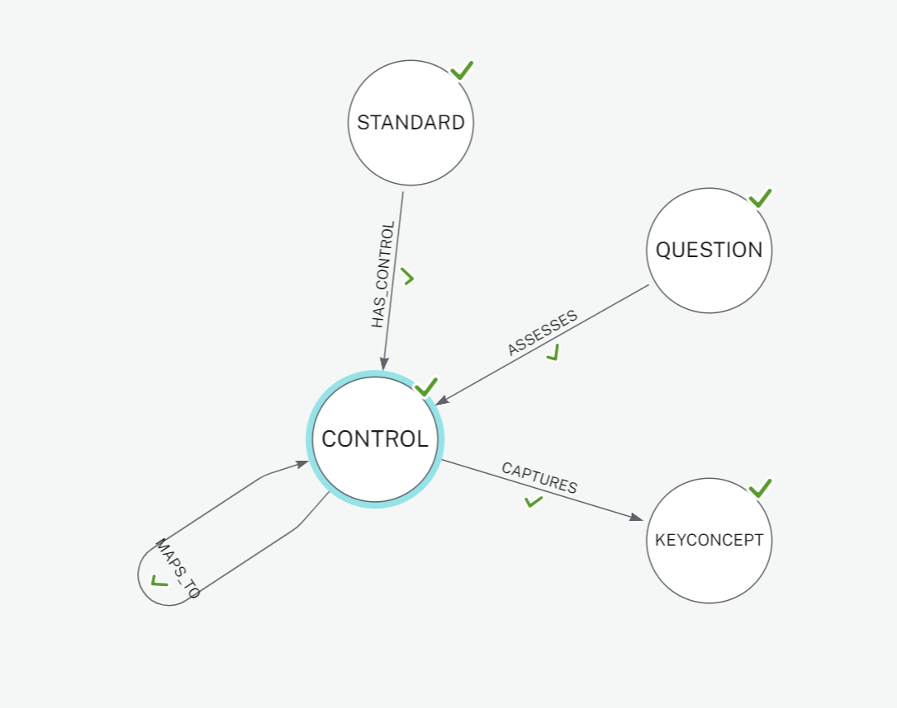

# CSF Knowledge Graph (KG)

Organizations transitioning from NIST CSF version 1.1 to version 2.0 must address new and expanded requirements. With this prototype, we are attempting to explore and address the complexities and challenges of such transitioning efforts through use cases, leveraging LLM, Knowledge Graphs (KG) and RAG approaches. 

Some of the high-level use-cases considered in the process include:

- Graph based inference to effectively identify/discover derived relationships, cross-standard and cross-control implementation dependencies extending beyond NIST/Other Authority and SME provided explicit mappings. 
- Capability to perform compliance and risk assessments, across versions of CSF frameworks, potentially expanding to other mapped standards including:
  - CIS Critical Security Controls (CSC)
  - Control Objectives for Information and Related Technologies (COBIT) 5
  - ISA 62443-2-1:2009 & ISA 62443-3-3:2013 - Security Requirements (SR)
  - ISO/IEC 27001:2013
  - NIST SP 800-53 Rev. 4 & Rev. 5.1.1
  - CIS Controls v8.0
  - Cyber Resilience Index (CRI) Profile v2.0 
  - NIST SP 800-221A
  - Secure Software Development Framework SSDF v1.1
- Support for RAG (Retrieval-augmented-generation) in the provision of high-quality features, and embeddings for Generative AI, potentially addressing shortcomings and hallucinations in large language models (LLMs).

**Description**:  

Python and AuraDB [Neo4J] KG prototype, along with the basic command-line utilities for building and deploying the CSF v2.0 and v1.1 KG related associative network of nodes and relationships. Resulting KG provides:
 - Standard & Controls Subgraph with explicit mappings for Cybersecurity Standards/controls per NIST CSF v2.0 documentation and toolkits
 - Assessment questionnaires and corpus segments generated by Open AI and scoped by CSF controls
 - A *Key Concepts* subgraph capturing the semantics of CSF controls. The processing pipeline for the subgraph leverages intermediary Open AI generated core concept segments as corpus,  along with PatternRank + KeyBERT.

The goal of the prototyping effort is to seamlessly address ever evolving compliance data scope for 

**Status**:  Baseline version 1.0

---
### KG Model


---

### Model Build, Processing and RAG Pipelines


## Runtime Env and Dependencies
*Tested on*: Ubuntu 22.04 - *Python Version*: 3.10.12 

*Requires:* Pyhton version 3.10 or greater

Active [OpenAI API](https://platform.openai.com/) subscription allowing access to GPT 3.5+ (More on creating API keys at: [Go-OpenAI](https://github.com/sashabaranov/go-openai?tab=readme-ov-file#getting-an-openai-api-key) https://github.com/sashabaranov/go-openai?tab=readme-ov-file#getting-an-openai-api-key

Active [Neo4J - Aura](https://neo4j.com/cloud/platform/aura-graph-database/) free-tier subscription for protototype graph database access and deployment 

Optional for Inference [Langsmith](https://smith.langchain.com/) free-tier developer subscription for langchain LLM applications development platform.

## Configuration

###### ChatGPT API Connectivity

The utility expects the following environment variables to be set:

```bash
export NEO4J_URI=<YOUR_AURADB_URI>
export NEO4J_USER='neo4j'
export NEO4J_PASSWORD=<YOUR_AURADB_PWD>
export OPEN_API_SECRET=<YOUR_OPEN_API_SECRET>
```

###### Graph Build Settings

Sample keyBERT configuration is available at: `./config/keybert.json`
For graph model and CSV/JSON extraction paths, constants and enumerations, refer to `./config/includes.py`


## Usage

Following AuraDB [Neo4J] Cypher and command line utilities are built to demonstrate  a small subset of CSF KG use-cases:

###### Knowledge Graph Inferences / Queries

- CSF 2.0 Control / domain *Key Concept* Subgraph:

  - AuraDB [Neo4J] (Cypher) graph query illustrating PatternRank + KeyBert, [KeyBert + LLM] extracted *Key Concept Nodes*

    - ```cypher
      MATCH (ctrl:CONTROL {name:"GV.OC-01"})-[rels:CAPTURES]->(keyc:KEYCONCEPT) 
      RETURN keyc.name;
      ```
    
    |                                                         |                                                         |
    | ------------------------------------------------------- | ------------------------------------------------------- |
    |  |  |
    
    * Compare the *Key Concept* relevance and quality for the CSF vs 2.0 control **GV.OC-01**:
    
      &#8594; Resulting from the processing pipeline with an intermediary Open AI extraction layer -> PatternRank (w KeyBERT)
    
      &#8594; To a sampling of key-term extracted with KeyBERT alone, directly working with the Open-AI generated corpus:
    
      > `python main.py extract --keyphrase --file corpus/csf-core/GV.OC-01.txt`
      > Extract Key Phrase - File: corpus/csf-core/GV.OC-01.txt , config:  {}
      > Key phrase:  ('**nist cybersecurity framework**', 0.6294)
      > Key phrase:  (**'impacted cybersecurity risks**', 0.5425)
      > Key phrase:  ('**csf version released**', 0.4583)
      > Key phrase:  ('**controls risk assessments**', 0.3998)
      > Key phrase:  ('**continuous improvement ensure**', 0.3597)
      > Key phrase:  ('**trends implementation policy**', 0.3334)
      > Key phrase:  ('**organizational mission broader**', 0.3212)
      > Key phrase:  ('**revisions new control**', 0.3164)
      > Key phrase:  ('**gv oc hypothetical**', 0.1893)
    
    


-  *Key Concept*  Subgraph: cross-control/standard mapping exploration via AuraDB [Neo4J] (Cypher)


  - All CSF v 2.0  and the (explicitly and by association) mapped v 1.1 controls clustered around the *Key Concept*: `incident response`

  ```cypher
  MATCH (keyc:KEYCONCEPT {name: "incident response"})<-[rels:CAPTURES]-(ctrl2:CONTROL)-[map:MAPS_TO]-(ctrl1:CONTROL)<-[stdc:HAS_CONTROL]-(std1:STANDARD)
  RETURN keyc, ctrl2,ctrl1, std1, rels, map, stdc
  ```

  |  |
  | ------------------------------------------------------------ |
  |  |

CSF Compliance Assistant: 

* Graph queries to retrieve CSF Control compliance assessment questions:


- Assistant operating via RAG 

Model build utilities:

+ KeyPhrase extraction
+ Neo4J Access
+ AuraDB upload for subgraphs capturing: 
  + Standard, Control cross-maps 
  + Key concept network
  + Assessment Questionnaires


## Testing

[TODO] Rudimentary testing to be provided via `PyTest`

## Features to Implement & Known issues

- Baseline testing for `NEO4JConnector`, `GraphProcessor`, and `KeyTermExtractor` classes
- Inference Module to be added demonstrating RAG via LangChain+OpenAI Embeddings
- Dockerized version for the CLI
- Neo4J GIST submission

## Getting help

If you have questions, concerns, bug reports, etc, please file an issue in this repository's Issue Tracker.

## Open source licensing info
1. [LICENSE](LICENSE)

----
## Credits and references

#### [CSF Tools](https://csf.tools/) 

Exploration and Visualization Tools by NIST Cybersecurity Framework (CSF) and Privacy Framework (PF)

#### PatternRank

#### KeyBERT

#### LangChain

#### Neo4J

